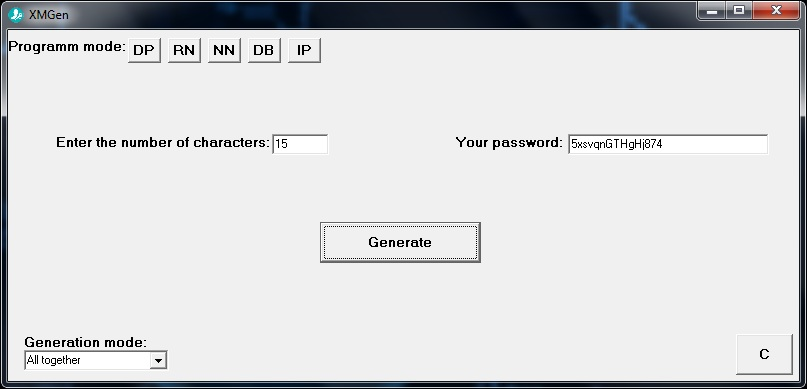
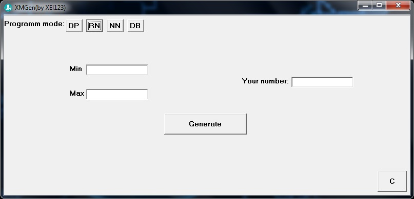
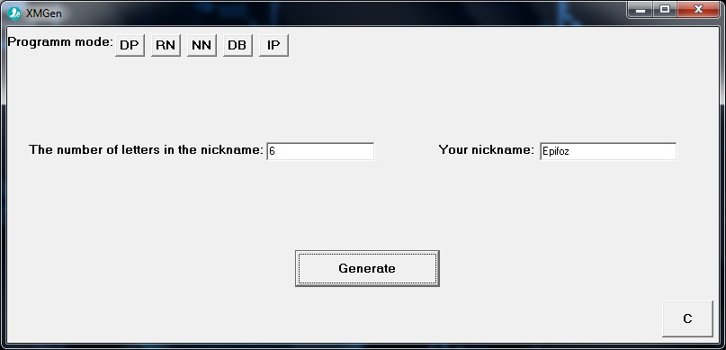
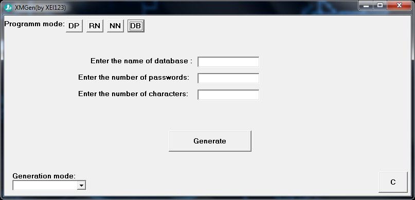

<h2>About</h2>

This program can generate passwords,random numbers,nicknames and database of passwords.It is a comfortable multifunctional generator

<h2>How to start</h2>

1.Open Project1.exe file

<h2>Author</h2>

XEl123

<h2>Platform</h2>

OS Windows

<h2>Version</h2>

0.0.1

<h2>Language</h2>

C++

<h2>Screenshots</h2>

