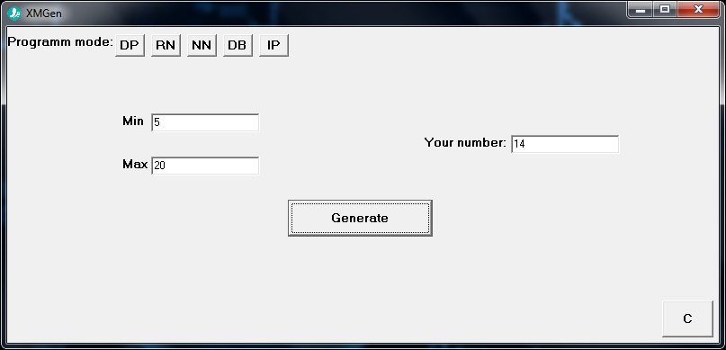
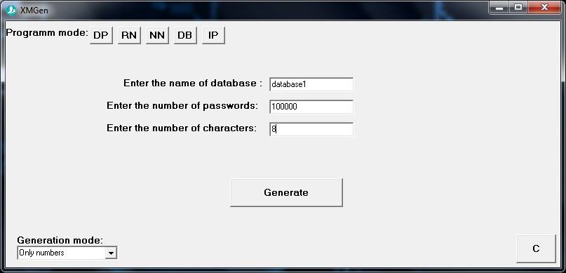

<h2>About</h2>

This program can generate passwords,random numbers,nicknames,IP-adress and database of passwords.It is a comfortable multifunctional generator

<h2>How to start</h2>

1.Open XMGen.exe file 

<h2>Author</h2>

XEl123

<h2>Platform</h2>

OS Windows

<h2>Version</h2>

0.0.4

<h2>E-Mail</h2>

xel5043@gmail.com

<h2>Problems</h2>

If the program doesn't work,try to download Borland C++ Builder 6

<h2>Screenshots</h2>

